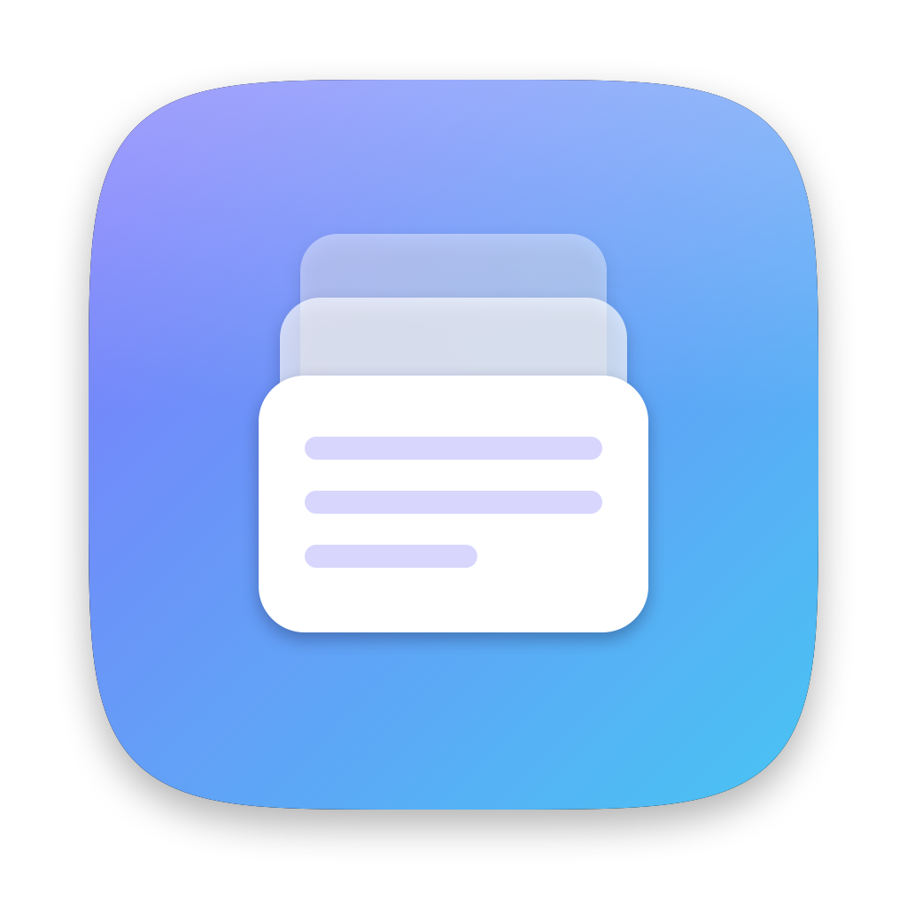
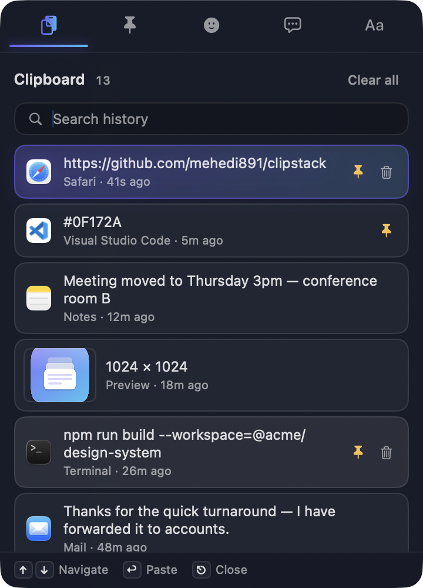
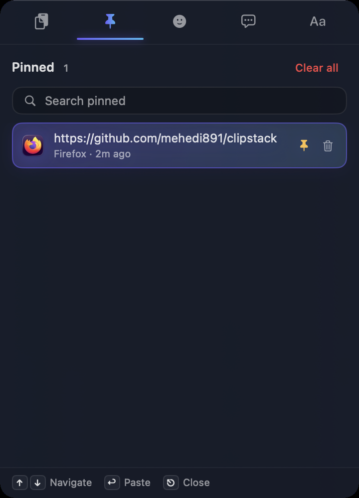
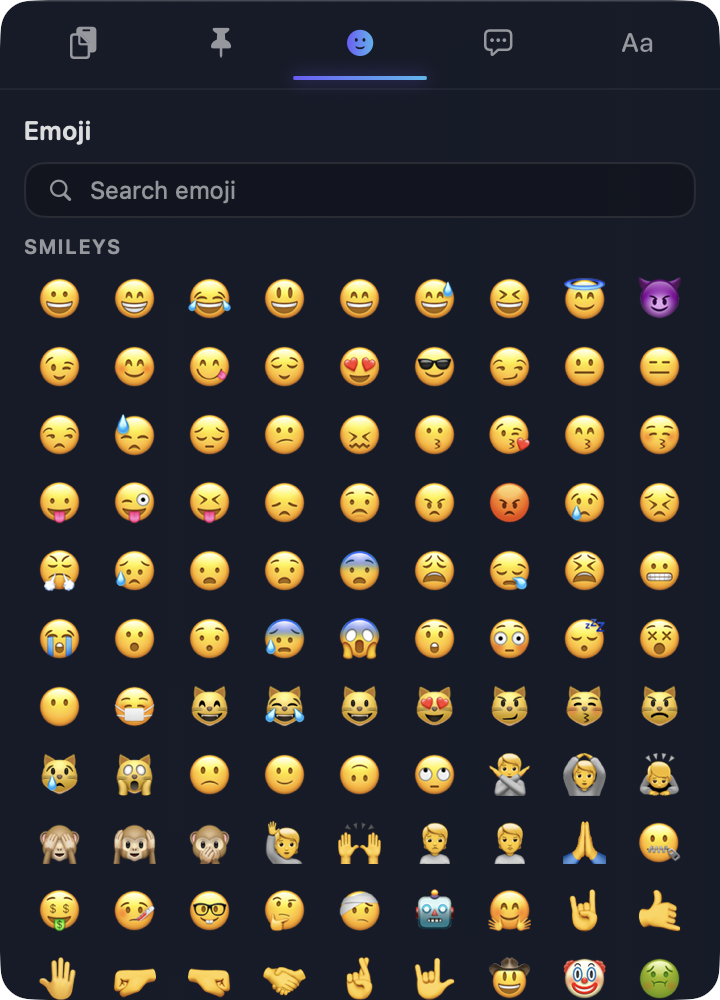
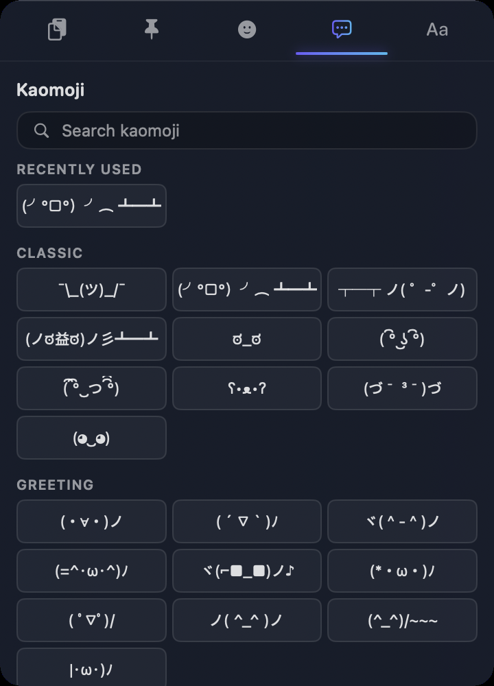
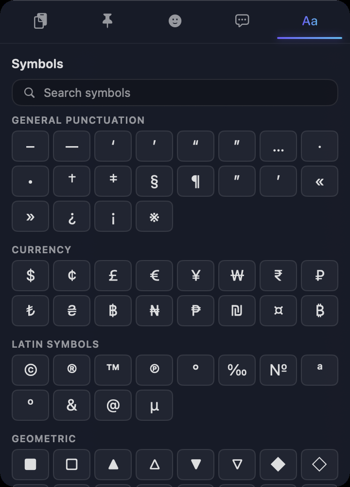
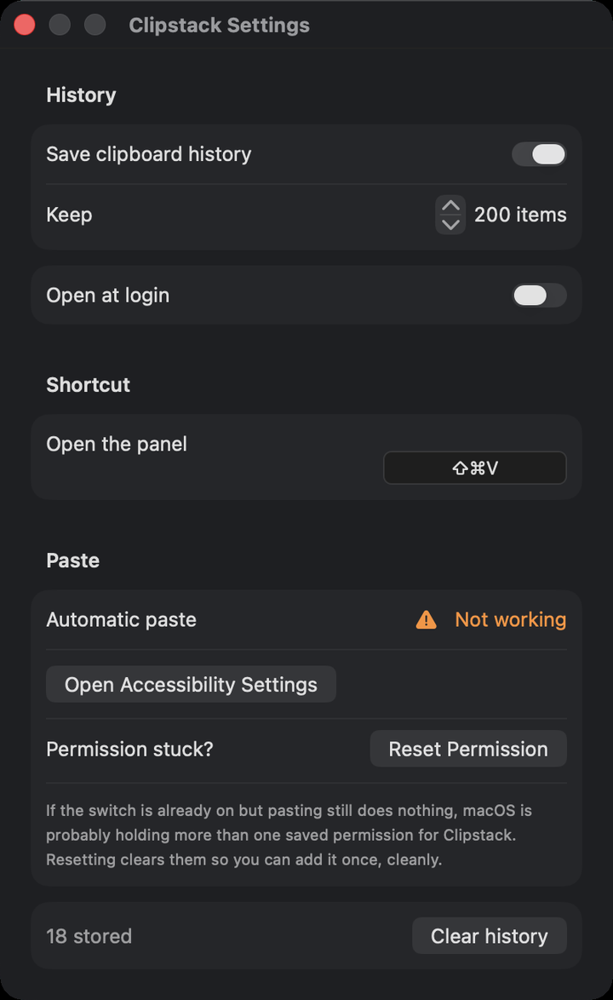

# Clipstack

Clipstack remembers what you copy. Press **⇧⌘V** to see everything you copied
before. Click one, and it gets pasted right where you were typing.



**What you get**

- A list of what you copied — text, styled text, and pictures
- Search your history
- Pin the things you want to keep forever
- Emoji, kaomoji, and symbols built in (964 emoji, all offline)
- Lives in the menu bar. No Dock icon.
- Works fully offline. Nothing you copy is ever sent anywhere.

You need **macOS 14 or newer**.

<p align="center">
  
</p>

---

## How to install

There are two ways. Pick the one that sounds like you.

---

### Way 1 — I just want to use it

**Step 1.** Download `Clipstack.dmg` from the
[Releases page](https://github.com/mehedi891/clipstack/releases). Double-click it.

**Step 2.** A window opens with the Clipstack icon and a folder called
Applications. Drag the icon onto the folder.

**Step 3.** Open your Applications folder and find Clipstack.

**Step 4.** Double-click Clipstack. A box appears saying **Apple could not
verify** it. That is expected. Click **Done**. (If the box also offers **Move to
Trash**, do not click that — click **Done**.)

**Step 5.** Open **System Settings** → **Privacy & Security**. Scroll to the
bottom. There is a line saying Clipstack was blocked, with an **Open Anyway**
button. Click it.

**Step 6.** Use Touch ID or type your password.

**Step 7.** Open Clipstack again. Click **Open**.

That's it. You only do this once. After that it opens like any other app.

> **Why all that?**
> macOS only trusts apps checked by Apple, and that check costs the developer
> 99 USD a year. Clipstack has not paid it yet, so macOS stops it once and asks
> you to confirm. The steps above are how you say yes.

> **Does right-clicking and picking Open work instead?**
> Not any more. That shortcut existed until macOS 14. Apple removed it in
> macOS 15 Sequoia, so on any recent Mac you have to use System Settings as
> described above.

> **Want one command instead?** Open the Terminal app, paste this, press
> Return, and Clipstack will open normally afterwards:
>
> ```sh
> xattr -dr com.apple.quarantine /Applications/Clipstack.app
> ```
>
> This also fixes it if macOS calls the app **"damaged"**. It isn't — that is
> what macOS says about apps it cannot check.

---

### Way 2 — I'm comfortable with the Terminal

Build it yourself. Nothing gets blocked this way.

**Step 1.** Open the Terminal app.

**Step 2.** Paste these lines, one at a time:

```sh
git clone https://github.com/mehedi891/clipstack.git
cd clipstack
./install.sh
```

**Step 3.** Wait about a minute. The script does the rest and starts the app.

Look for the clipboard icon in your menu bar at the top of the screen.

**If it says `swift` was not found**, you need Apple's developer tools. Run this,
then try again:

```sh
xcode-select --install
```

You do **not** need Xcode. The small Command Line Tools are enough.

<details>
<summary>Extra options</summary>

```sh
./install.sh --no-cert   # skip the signing certificate
./install.sh --here      # run from ./build instead of Applications
```
</details>

---

## Two things to do after installing

### 1. Turn on your history

Press **⇧⌘V**. A small window opens. Click the **Turn on** button.

Clipstack does not save anything until you do this.

### 2. Let Clipstack paste for you

This one is worth doing. It's what makes clicking an item paste it right away.

1. Open **System Settings**
2. Click **Privacy & Security**
3. Click **Accessibility**
4. Click the **+** button
5. Pick **Clipstack** from your Applications folder
6. Turn the switch **on**

**What if I skip this?** Clipstack still works. Clicking an item copies it, and
you press **⌘V** yourself. You just do one extra keypress.

**Turned the switch on but it still doesn't paste?** This happens, and there is
a button for it. Open Clipstack's **Settings**, and under **Paste** click
**Reset Permission**. See [Problems](#macos-keeps-asking-for-permission-over-and-over).

---

## How to use it

Press **⇧⌘V** to open the window. It has five tabs along the top.

| Tab | Press | What's in it |
|---|---|---|
| **Clipboard** | ⌘1 | Everything you copied, newest first |
| **Pinned** | ⌘2 | Only the items you pinned. Never deleted on their own. |
| **Emoji** | ⌘3 | 964 emoji. Type to search by name. |
| **Kaomoji** | ⌘4 | Text faces like `¯\_(ツ)_/¯` |
| **Symbols** | ⌘5 | Arrows, currency, maths signs, and more |

Click anything to paste it. Everything works without the internet.

<table>
<tr>
<td align="center" width="25%">
  <br>
  <sub><b>Pinned</b></sub>
</td>
<td align="center" width="25%">
  <br>
  <sub><b>Emoji</b></sub>
</td>
<td align="center" width="25%">
  <br>
  <sub><b>Kaomoji</b></sub>
</td>
<td align="center" width="25%">
  <br>
  <sub><b>Symbols</b></sub>
</td>
</tr>
</table>

**To pin something**, hover over it in the Clipboard tab and click the pin. It
moves to the Pinned tab and stays there for good. To unpin it, click the pin
again — the item goes back to your normal history.

### Keyboard shortcuts

| Press this | To do this |
|---|---|
| **⇧⌘V** | Open or close the window |
| **↑** and **↓** | Move up and down the list |
| **⏎** (Return) | Paste the one you picked |
| **⎋** (Escape) | Close the window |
| **⌘1** to **⌘5** | Jump between the tabs |

You can also click the menu bar icon to open it. Right-click that icon for
Settings and Quit.

**About the limit.** Clipstack keeps your last 200 copies and deletes older ones
to make room. Pinned items don't count and are never deleted. You can change 200
to any number from 10 to 1000 in Settings.

### Settings

Right-click the Clipstack icon in your menu bar and click **Settings**.



| Setting | What it does |
|---|---|
| **Save clipboard history** | The main on/off switch. Off means nothing new is saved. |
| **Keep _N_ items** | How many copies to remember, from 10 to 1000. Pinned items don't count. |
| **Open at login** | Start Clipstack automatically when you turn on your Mac. |
| **Open the panel** | Click the box, then press the keys you want. At least one of ⌘ ⇧ ⌥ ⌃ is required. |
| **Automatic paste** | Shows whether Clipstack is allowed to paste for you. |
| **Reset Permission** | Clears macOS's saved permission so you can grant it again. Fixes the most common problem below. |
| **Clear history** | Deletes everything, including pinned items. |

---

## Problems and how to fix them

### macOS keeps asking for permission, over and over

You switch Clipstack on in System Settings, and it still says it has no
permission. This is the most common problem.

**Try this first.** It works no matter how you installed Clipstack:

1. Right-click the Clipstack icon in your menu bar
2. Click **Settings**
3. Under **Paste**, click **Reset Permission**, then confirm
4. System Settings opens on its own
5. Click **+**, pick **Clipstack**, and turn the switch on

Clipstack tells you how many saved permissions it cleared. **If it says more
than one, that was your problem** — macOS was holding two records and checking
the wrong one.

**If you cloned the repo**, this script does the same thing and also checks the
other causes:

```sh
./scripts/fix-permissions.sh
```

Still stuck? Here are the four causes, and what each one looks like.

#### Cause 1: You opened the app from the disk image

If you double-clicked the `.dmg` file and started Clipstack from that window,
this will happen every time.

A disk image is like a CD. macOS can't save permissions for an app on a CD.

**Fix:** Drag Clipstack into your Applications folder. Then open it from there.

#### Cause 2: macOS has two records for the same app

This can happen after you move, rename, or rebuild the app. macOS shows you one
record but checks a different one. So flipping the switch does nothing.

**Fix:** Use **Settings → Paste → Reset Permission**, as described above.

Or from the Terminal, if you prefer:

```sh
tccutil reset Accessibility com.efoli.Clipstack
```

#### Cause 3: The app has no signing certificate

macOS ties permission to the app's **signature** — a kind of fingerprint. Without
a certificate, the fingerprint changes every time you build. macOS then thinks
it's a brand new app and forgets your permission.

`install.sh` sets this up for you. If you skipped it, do it now:

```sh
./scripts/create-signing-cert.sh
./scripts/build-app.sh
tccutil reset Accessibility com.efoli.Clipstack
```

Then give permission one more time. It will stick from now on.

This only helps on **your own** Mac. See [Sharing](#sharing-clipstack-with-others).

#### Cause 4: macOS is running a hidden copy

When you download an app, macOS sometimes runs it from a hidden temporary folder
instead of where you put it. Clipstack tells you in the window when this happens.

**Fix:**

```sh
xattr -dr com.apple.quarantine /Applications/Clipstack.app
```

Then open it again.

### ⇧⌘V doesn't do anything

Another app has already claimed that shortcut. Open **Settings** and pick a
different one under **Open the panel**. Settings warns you when a shortcut is
already taken.

### Nothing shows up in my history

Clipstack starts switched off. Press **⇧⌘V** and click **Turn on**.

Also note: if your password manager marks something as secret, Clipstack skips
it on purpose. That is not a bug.

### The window looks broken or won't open

Run this to see what's wrong:

```sh
CLIPSTACK_DEBUG_PANEL=1 /Applications/Clipstack.app/Contents/MacOS/Clipstack
```

It prints messages in your Terminal that explain the problem.

---

## Sharing Clipstack with others

Make an installer file:

```sh
./scripts/make-dmg.sh
```

You get `dist/Clipstack-<version>.dmg`. You can send that file to anyone.

**But there's a catch.** macOS is careful about apps from makers it doesn't
know. What your friend sees depends on how the app was signed:

| How it's signed | What they have to do |
|---|---|
| Apple Developer ID, checked by Apple | Just double-click. Nothing else. |
| Apple Developer ID only | Approve once in System Settings → Privacy & Security |
| No certificate (the default here) | Approve once in System Settings → Privacy & Security, or one Terminal command |
| They build it themselves | Nothing. It just works. |

**Can a non-technical person use the default?** Yes, but not smoothly. macOS
blocks the app on the first launch, and they have to go into System Settings and
click **Open Anyway** to allow it. Some people will manage that. Others will give
up, or think the app is broken.

This got harder in macOS 15 Sequoia: before it, right-clicking the app and
choosing Open was enough. Apple removed that, so there is no quick bypass left.

Way 1 in [How to install](#how-to-install) is written for exactly this, in plain
steps you can copy into an email.

**To send a `.dmg` that just works**, you need an
[Apple Developer account](https://developer.apple.com/programs/). It costs 99 USD
a year. A free certificate will not work here — macOS only trusts certificates
that come from Apple.

If you have one:

```sh
xcrun notarytool store-credentials clipstack \
    --apple-id you@example.com --team-id TEAMID

CODESIGN_IDENTITY="Developer ID Application: Your Name (TEAMID)" \
NOTARY_PROFILE="clipstack" ./scripts/make-dmg.sh
```

The script sends the app to Apple, waits for their answer, and attaches the
result to your file. Your friend can then open it even with no internet.

---

## How to uninstall

```sh
./scripts/uninstall.sh
```

It shows you what it will delete and asks before doing anything. Add `--yes` to
skip the question.

It deletes the app, your saved history, your pictures, and your settings.

**One step you must do yourself.** macOS protects this list, so no script can
touch it:

> System Settings → Privacy & Security → Accessibility
> Pick Clipstack, then click the **–** button.

Clipstack puts nothing outside your home folder, and never starts at login unless
you turn that on.

---

## Where your data is kept

```
~/Library/Application Support/Clipstack/
  history.sqlite     your copied text
  images/            your copied pictures
```

It sits on your own disk, in a plain file. Nothing is uploaded anywhere.

Delete that folder to start fresh.

---

## For developers

```sh
./scripts/build-app.sh    # build build/Clipstack.app
./scripts/run.sh          # build, then restart the app
./scripts/test.sh         # run the tests
```

**Project layout.** `ClipstackCore` holds the logic and is unit tested.
`Clipstack` is a thin AppKit and SwiftUI shell on top. They are separate because
a test target cannot depend on an executable target.

**Tests use swift-testing, not XCTest.** The Command Line Tools ship
`Testing.framework` but no XCTest. Use `scripts/test.sh` — it passes the extra
search paths that SwiftPM leaves out.

**The app is not sandboxed.** The sandbox blocks apps from sending fake key
presses to other apps, and that is exactly how auto-paste works.

**`NSHostingView.sizingOptions` is `[]`**, and the panel's minimum and maximum
size are locked. Otherwise SwiftUI pushes its preferred size onto the window, and
a tall tab stretches the panel off the screen.

### Rebuilding the emoji list and icon

```sh
python3 scripts/generate-emoji.py    # → Sources/ClipstackCore/Resources/emoji.json
swift scripts/generate-icon.swift    # → build/Clipstack.iconset, Assets/icon-1024.png
```

The emoji list comes from Python's built-in Unicode data, so it needs no network
and no extra packages. The trade-off: it only has emoji up to whatever Unicode
version your Python ships with.

The icon is drawn in code so it always matches the design tokens in
`Sources/Clipstack/UI/Theme.swift`. The menu bar glyph is **not** drawn by us —
it is Apple's `list.clipboard` symbol, because a shrunken logo looked like a
padlock at that size.

---

## License

MIT — see [LICENSE](LICENSE). You may use, change, and share this freely.
